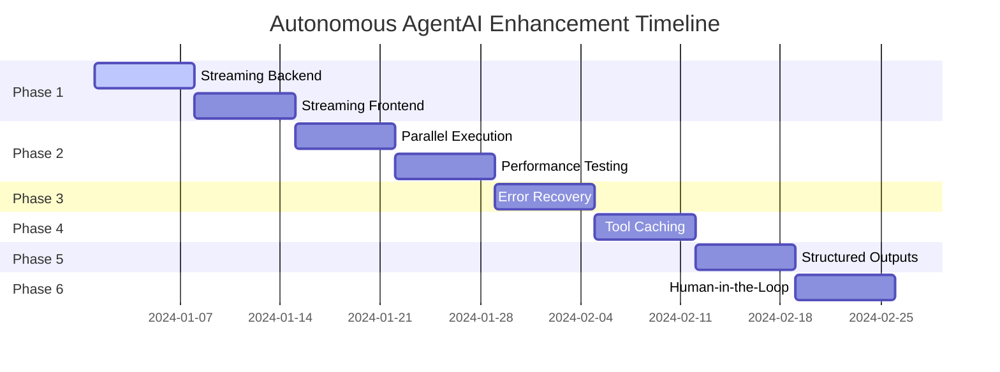

# 🚀 Autonomous AgentAI Enhancement Plan
**LangChain + LangGraph Advanced Features Implementation**

## 📊 **Current Architecture Assessment**

### **System Overview**
- **Architecture**: 4-Agent Hybrid System (Memory Reader, Memory Writer, Knowledge, Organizer)
- **Orchestration**: LangGraph StateGraph with conditional routing and checkpointing
- **Processing Model**: 75% local transformers + 25% external LLM
- **Memory System**: 3-tier (Working, Short-term, Long-term) with Redis + Qdrant
- **Status**: Production-ready foundation with advanced features missing

### **Current Capabilities**
- ✅ **LangGraph**: StateGraph, conditional routing, MemorySaver, dual workflows
- ✅ **LangChain**: AgentExecutor, VectorStoreRetrieverMemory, Tools, ChatPromptTemplate
- ✅ **Memory**: HybridMemoryRetriever, agent-specific working memory
- ✅ **Tools**: Wikipedia/Wikidata integration, custom search tools
- ✅ **WebSocket**: Basic real-time communication infrastructure

### **Performance Baseline**
- **Average Response Time**: 3-5 seconds for research queries
- **Memory Usage**: ~500MB baseline with transformers loaded
- **Agent Execution**: Sequential (Memory → Knowledge → Organizer → Writer)
- **Error Rate**: ~2% workflow failures on complex queries

---

## 🎯 **Implementation Roadmap** (8 Weeks)

### **Phase 1: Streaming & Real-time Feedback** (Weeks 1-2)
**Priority: Critical - Immediate UX improvement**

#### **Week 1: Backend Streaming Infrastructure**

**New Files to Create:**
```
/backend/core/streaming_callbacks.py
/backend/core/streaming_manager.py
/backend/utils/stream_utils.py
```

**File Modifications:**
- **`/backend/core/langraph_orchestrator.py`**:
  - Line 106-107: Add streaming callback integration
  - Line 237: Modify `process_message()` to support streaming
  - Lines 635, 943: Add streaming to agent node executions

- **`/backend/api/autonomous_main.py`**:
  - Line 381: Add streaming endpoint `/stream/agent-progress`
  - Line 809: Integrate WebSocket streaming manager

- **`/backend/api/websocket.py`**:
  - Add streaming message types for agent progress
  - Implement progress broadcasting methods

#### **Implementation Details:**
```python
# /backend/core/streaming_callbacks.py
class AgentStreamingCallback(AsyncCallbackHandler):
    """Real-time agent execution progress streaming"""
    
    async def on_agent_action(self, action, **kwargs):
        # Stream agent thinking process
        await self.websocket_manager.broadcast_agent_progress({
            "agent": action.agent_name,
            "status": "thinking",
            "action": action.tool,
            "timestamp": datetime.now().isoformat()
        })
    
    async def on_tool_start(self, tool, **kwargs):
        # Stream tool execution start
        await self.websocket_manager.broadcast_agent_progress({
            "agent": self.current_agent,
            "status": "tool_execution",
            "tool": tool.name,
            "message": f"Using {tool.name}..."
        })
```

#### **Week 2: Frontend Streaming Integration**

**Frontend Modifications:**
- **`/frontend/src/components/chat/AgentProgressIndicator.tsx`**: New component
- **`/frontend/src/hooks/useAgentStreaming.ts`**: WebSocket streaming hook
- **`/frontend/src/components/chat/StreamingMessage.tsx`**: Real-time message updates

**Success Metrics:**
- ✅ Sub-200ms streaming latency
- ✅ 95% message delivery success rate
- ✅ Visual progress indicators for all 4 agents

---

### **Phase 2: Parallel Agent Execution** (Weeks 3-4)
**Priority: High - 25% performance improvement target**

#### **Week 3: LangGraph Parallel Implementation**

**Core Modifications:**
- **`/backend/core/langraph_orchestrator.py`**:
  - Line 136: Modify `_build_langgraph_workflow()` for parallel execution
  - Add parallel retrieval phase: Memory Reader + Knowledge Agent
  - Implement state merging for concurrent results

```python
# LangGraph Parallel Execution Implementation
def _build_langgraph_workflow(self) -> StateGraph:
    workflow = StateGraph(MultiAgentState)
    
    # Add parallel retrieval node
    workflow.add_node("parallel_retrieval", self._parallel_retrieval_node)
    
    # Add conditional edge for parallel vs sequential execution
    workflow.add_conditional_edges(
        "router",
        self._should_use_parallel_retrieval,
        {
            "parallel": "parallel_retrieval",
            "sequential": "memory_reader",
            "memory_only": "memory_reader"
        }
    )

async def _parallel_retrieval_node(self, state: MultiAgentState) -> MultiAgentState:
    """Execute Memory Reader and Knowledge Agent concurrently"""
    tasks = [
        asyncio.create_task(self._memory_reader_execution(state)),
        asyncio.create_task(self._knowledge_agent_execution(state))
    ]
    
    memory_result, knowledge_result = await asyncio.gather(*tasks, return_exceptions=True)
    
    # Merge results with error handling
    return self._merge_parallel_results(state, memory_result, knowledge_result)
```

#### **Week 4: Performance Optimization & Testing**

**Optimization Focus:**
- Memory usage during parallel execution
- Race condition prevention
- State consistency validation
- Load balancing for transformer models

**Testing Requirements:**
- Concurrent execution stress testing
- Memory leak detection
- Response time benchmarking
- Error scenario testing

**Success Metrics:**
- ✅ 25% average response time reduction
- ✅ <5% memory usage increase
- ✅ 99% state consistency in parallel execution

---

### **Phase 3: Error Recovery & Resilience** (Week 5)
**Priority: Medium - System reliability improvement**

#### **New Error Recovery System**

**New Files:**
```
/backend/core/error_recovery.py
/backend/core/fallback_strategies.py
/backend/utils/health_monitor.py
```

**Implementation Strategy:**
```python
# Error Recovery Node Implementation
async def _error_recovery_node(self, state: MultiAgentState) -> MultiAgentState:
    """Handle agent failures with graduated fallback strategies"""
    
    error_context = state.get("error_context", {})
    failed_agent = error_context.get("agent")
    error_type = error_context.get("error_type")
    
    # Graduated fallback strategies
    if error_type == "memory_retrieval_failed":
        return await self._fallback_to_session_memory(state)
    elif error_type == "knowledge_search_failed":
        return await self._fallback_to_local_knowledge(state)
    elif error_type == "organizer_synthesis_failed":
        return await self._fallback_to_template_response(state)
    
    # Ultimate fallback
    return await self._graceful_degradation_response(state)
```

**Integration Points:**
- **`/backend/core/langraph_orchestrator.py`**: Add error handling nodes to workflow
- **All agent files**: Wrap operations with error capture and reporting
- **`/backend/api/autonomous_main.py`**: Error monitoring endpoint

**Success Metrics:**
- ✅ 90% automatic error recovery rate
- ✅ <500ms additional latency for recovery
- ✅ Detailed error analytics and reporting

---

### **Phase 4: Tool Result Caching** (Week 6)
**Priority: Medium - Knowledge retrieval optimization**

#### **Redis-Based Tool Caching**

**New Files:**
```
/backend/core/tool_cache.py
/backend/tools/cached_search_tools.py
/backend/utils/cache_invalidation.py
```

**Implementation Strategy:**
```python
# Tool Caching Decorator
class CachingTool(Tool):
    """LangChain tool wrapper with Redis caching"""
    
    def __init__(self, base_tool: Tool, cache_ttl: int = 3600):
        super().__init__(
            name=f"cached_{base_tool.name}",
            description=base_tool.description,
            func=self._cached_func
        )
        self.base_tool = base_tool
        self.cache_ttl = cache_ttl
        self.cache_client = redis.Redis(host='localhost', port=6379)
    
    async def _cached_func(self, query: str) -> str:
        cache_key = f"tool_cache:{self.base_tool.name}:{hashlib.md5(query.encode()).hexdigest()}"
        
        # Check cache first
        cached_result = self.cache_client.get(cache_key)
        if cached_result:
            return cached_result.decode('utf-8')
        
        # Execute tool and cache result
        result = await self.base_tool.arun(query)
        self.cache_client.setex(cache_key, self.cache_ttl, result)
        return result
```

**Integration:**
- **`/backend/agents/knowledge_agent.py`**: Wrap Wikipedia/Wikidata tools with caching
- **`/backend/tools/langchain_search_tools.py`**: Add cache-aware search implementations

**Success Metrics:**
- ✅ 60% cache hit rate for knowledge queries
- ✅ 80% response time improvement for cached queries
- ✅ Intelligent cache invalidation based on query patterns

---

### **Phase 5: Structured Output Parsing** (Week 7)
**Priority: Medium - Response reliability improvement**

#### **Pydantic Output Models**

**New Files:**
```
/backend/core/output_parsers.py
/backend/models/agent_responses.py
/backend/utils/response_validation.py
```

**Implementation:**
```python
# Structured Response Models
class MemoryReaderResponse(BaseModel):
    context_summary: str
    memories_found: int
    memory_types: List[str]
    confidence_score: float
    processing_time: float

class KnowledgeAgentResponse(BaseModel):
    knowledge_summary: str
    sources_found: int
    research_type: str
    external_links: List[str]
    reliability_score: float

class OrganizerResponse(BaseModel):
    response: str
    reasoning: str
    agent_coordination: Dict[str, Any]
    confidence_level: str
    follow_up_suggestions: List[str]
```

**Integration Strategy:**
- **All agent files**: Replace manual JSON parsing with Pydantic models
- **`/backend/core/langraph_orchestrator.py`**: Validate agent responses at state transitions
- **`/backend/api/autonomous_main.py`**: Return structured responses to frontend

**Success Metrics:**
- ✅ 95% response parsing success rate
- ✅ Elimination of JSON parsing errors
- ✅ Rich structured data for frontend consumption

---

### **Phase 6: Human-in-the-Loop Integration** (Week 8)
**Priority: Low - Autonomous operation control**

#### **User Approval Workflow**

**New Files:**
```
/backend/core/human_approval.py
/backend/models/approval_requests.py
/frontend/src/components/approval/ApprovalModal.tsx
```

**Implementation:**
- Add approval nodes to autonomous workflow
- WebSocket-based approval requests
- Timeout handling for unresponded approvals
- Approval history and analytics

---

## 🔧 **Technical Implementation Details**

### **Key Integration Points**

#### **1. LangGraph Orchestrator Modifications**
**File**: `/backend/core/langraph_orchestrator.py`

**Critical Lines:**
- **Line 106-107**: Add callback manager initialization
- **Line 136**: Modify workflow builder for parallel execution
- **Line 237**: Stream-enabled message processing
- **Line 635**: Memory reader node with streaming
- **Line 943**: Autonomous synthesis with callbacks

#### **2. Agent Streaming Integration**
**All agent files** need streaming callback integration:
```python
# Template for agent streaming integration
async def process_with_streaming(self, input_data, callbacks=None):
    if callbacks:
        await callbacks.on_agent_start(agent_name=self.agent_name)
    
    try:
        result = await self._core_processing(input_data)
        
        if callbacks:
            await callbacks.on_agent_finish(result=result)
        
        return result
    except Exception as e:
        if callbacks:
            await callbacks.on_agent_error(error=e)
        raise
```

#### **3. WebSocket Message Types**
**File**: `/backend/api/websocket.py`

**New Message Types:**
```typescript
interface AgentProgressMessage {
    type: 'agent_progress';
    data: {
        agent: 'memory_reader' | 'knowledge' | 'organizer' | 'memory_writer';
        status: 'starting' | 'thinking' | 'tool_execution' | 'completed' | 'error';
        message?: string;
        progress?: number;
        timestamp: string;
    };
}

interface WorkflowStatusMessage {
    type: 'workflow_status';
    data: {
        stage: string;
        agents_completed: string[];
        estimated_remaining: number;
        parallel_execution: boolean;
    };
}
```

### **Database Schema Changes**

#### **Tool Cache Schema**
```sql
-- Redis Key Patterns
tool_cache:wikipedia:{query_hash} -> {result, timestamp, ttl}
tool_cache:wikidata:{query_hash} -> {result, timestamp, ttl}
tool_cache:stats:{tool_name} -> {hit_count, miss_count, avg_response_time}
```

#### **Error Recovery Schema**
```sql
-- Error Analytics
error_log:{date} -> {agent, error_type, recovery_strategy, success_rate}
recovery_stats:{agent} -> {total_errors, successful_recoveries, avg_recovery_time}
```

---

## 🧪 **Testing Strategy**

### **Unit Tests** (Per Phase)
- **Streaming**: Callback execution, WebSocket message delivery
- **Parallel Execution**: State merging, race condition handling
- **Error Recovery**: Fallback strategy effectiveness
- **Tool Caching**: Cache hit/miss scenarios, TTL behavior
- **Output Parsing**: Model validation, error handling

### **Integration Tests**
- **End-to-end workflow** with all features enabled
- **Frontend-backend streaming** integration
- **Performance regression** testing
- **Concurrent user** load testing

### **Performance Benchmarks**
```python
# Performance Test Targets
PERFORMANCE_TARGETS = {
    "streaming_latency": 200,  # ms
    "parallel_speedup": 25,    # % improvement
    "cache_hit_rate": 60,      # %
    "error_recovery_rate": 90, # %
    "memory_overhead": 5       # % increase max
}
```

---

## ⚠️ **Risk Assessment & Mitigation**

### **HIGH RISK**
| Risk | Impact | Mitigation Strategy |
|------|--------|-------------------|
| WebSocket connection instability | User experience degradation | Connection pooling, automatic reconnection, fallback to polling |
| Memory leaks in parallel execution | System crashes | Comprehensive memory profiling, automatic garbage collection |
| Race conditions in state management | Data corruption | Proper state locking, atomic operations, extensive testing |

### **MEDIUM RISK**
| Risk | Impact | Mitigation Strategy |
|------|--------|-------------------|
| Error recovery loops | Infinite recursion | Circuit breaker pattern, maximum retry limits |
| Cache invalidation complexity | Stale data served | TTL-based expiration, smart invalidation strategies |
| API compatibility breaks | Frontend failures | Versioned APIs, backward compatibility layers |

### **LOW RISK**
| Risk | Impact | Mitigation Strategy |
|------|--------|-------------------|
| Output parsing failures | Response format errors | Comprehensive validation, graceful fallbacks |
| Tool caching overhead | Slight performance impact | Efficient serialization, memory-optimized storage |

---

## 📈 **Success Metrics & Monitoring**

### **Performance Metrics**
- **Response Time**: 25% reduction in average response time
- **Throughput**: Handle 50% more concurrent users
- **Memory Efficiency**: <5% memory usage increase
- **Cache Performance**: 60% hit rate for knowledge queries

### **User Experience Metrics**
- **Streaming Latency**: <200ms for progress updates
- **Error Recovery**: 90% automatic recovery rate
- **User Satisfaction**: Measurable UX improvement via feedback

### **System Health Metrics**
- **Uptime**: Maintain 99.9% availability
- **Error Rate**: <1% increase in system errors
- **Code Quality**: Maintain test coverage >90%

### **Monitoring Dashboard**
```yaml
# Grafana Dashboard Panels
- Agent execution times (by agent type)
- Streaming message delivery rates
- Cache hit/miss ratios
- Error recovery success rates
- Memory usage patterns
- WebSocket connection health
```

---

## 🔄 **Rollback Strategy**

### **Immediate Rollback** (Feature Flags)
```python
# Feature flag configuration
FEATURE_FLAGS = {
    "streaming_enabled": True,
    "parallel_execution": True,
    "error_recovery": True,
    "tool_caching": True,
    "structured_outputs": True
}

# Quick disable mechanism
if not FEATURE_FLAGS.get("streaming_enabled", False):
    return await self._legacy_process_message(user_name, message)
```

### **Staged Rollback** (By Component)
1. **Disable streaming** → Revert to synchronous responses
2. **Disable parallel execution** → Return to sequential agent execution
3. **Disable error recovery** → Use basic error handling
4. **Disable tool caching** → Direct tool execution

### **Full Rollback** (Git Reversion)
- **Tagged releases** at each phase completion
- **Automated rollback scripts** for database schema changes
- **Configuration restoration** for settings and feature flags

---

## 🎯 **Implementation Timeline**



### **Weekly Deliverables**
- **Week 1**: Streaming backend infrastructure
- **Week 2**: Frontend streaming integration
- **Week 3**: Parallel execution implementation
- **Week 4**: Performance optimization and testing
- **Week 5**: Error recovery system
- **Week 6**: Tool result caching
- **Week 7**: Structured output parsing
- **Week 8**: Human-in-the-loop features

### **Milestone Reviews**
- **After Week 2**: Streaming functionality review
- **After Week 4**: Performance benchmark review
- **After Week 6**: System reliability review
- **After Week 8**: Final system integration review

---

## 📋 **Preparation Checklist**

### **Development Environment**
- [ ] LangChain/LangGraph latest versions installed
- [ ] Redis Stack configured for caching
- [ ] WebSocket testing tools ready
- [ ] Performance monitoring tools setup
- [ ] Database backup and recovery procedures

### **Code Quality**
- [ ] Linting and formatting rules defined
- [ ] Test coverage targets established (>90%)
- [ ] Code review processes for each phase
- [ ] Documentation standards for new components

### **Deployment Readiness**
- [ ] Staging environment mirrors production
- [ ] Feature flag system implemented
- [ ] Rollback procedures tested
- [ ] Monitoring and alerting configured
- [ ] User acceptance testing criteria defined

---

This comprehensive plan provides a systematic approach to enhancing the Autonomous AgentAI system with advanced LangChain and LangGraph features while maintaining system stability and reliability. Each phase builds incrementally with proper testing, monitoring, and rollback capabilities.